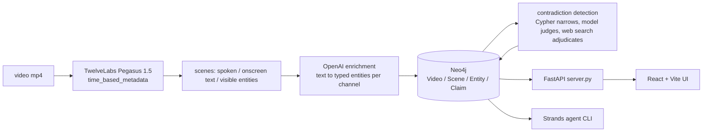

# The Unreliable Narrator

Ask a corpus of videos what nobody mentioned, and which two channels contradict each other — questions vector search cannot express.

Built at *Hack the Video Agent Context Graph*, AWS Builder Loft SF, 30 July 2026.

Entity search is not the point. Counting, negation, and cross-video contradiction are. A vector store can find the clip about linoleic acid; it cannot tell you how many channels mentioned it, which channels discussed inflammation and never mentioned it at all, or where two videos state incompatible things about the same substance.

## What it does

- Splits every scene into three separate channels — what was **said**, what was **shown**, what was **written on screen** — and keeps them apart all the way into the graph as `(:Scene)-[:MENTIONS {modality}]->(:Entity)`. Fused embeddings blend the channels, so "on screen but never spoken" stops being representable.
- Counts. `count(DISTINCT v)` over `MENTIONS` edges is exact; a similarity search asked "how many" makes a number up.
- Negates. `WHERE NOT EXISTS { ... }` finds the videos that discuss a topic and never touch the substance at the center of it.
- Finds contradictions across videos. A pure-Cypher query narrows every claim pair down to those from different channels about the same entity; a model then judges which genuinely conflict, and only the survivors get a web search.
- Writes verdicts back as edges — `(:Claim)-[:VERIFIED_AS {verdict}]->(:Evidence {url})` — where `verdict` is `SUPPORTED`, `DISPUTED`, or `NO_SOURCE_FOUND`. Never true or false.
- Turns a query result into a video. Any Cypher returning `videoId, startSec, endSec` is an edit decision list, and `build_supercut` hands it to ffmpeg.

The agent reads the graph and only reads it. Every write goes through deterministic Python in `ingest.py` and `verify.py`; the agent's Cypher tool refuses `CREATE`, `MERGE`, `DELETE`, `SET`, `REMOVE`, `DROP`, `FOREACH`, `LOAD CSV`, and `CALL db.*` / `CALL apoc.*`.

## Architecture



## Sponsor tools

| tool | used for |
|---|---|
| **TwelveLabs** | `analyze_async` with `pegasus1.5` and a `segment_definitions` response format. One call per video returns timestamped scenes with `spoken_claims`, `onscreen_text`, `visible_entities`, and `evidence_shown` as separate fields (`ingest.py`). |
| **OpenAI** | Three passes. Entity extraction per channel with a structured `response_format` (`ingest.py`); contradiction judging over candidate claim pairs (`verify.py`); adjudication against the literature via the native `web_search` tool on `/v1/responses` (`verify.py`). |
| **Neo4j** | Aura instance holding the graph. Uniqueness constraints on `Video.id`, `Scene.id`, `Entity.name`, `Claim.id`, so re-running ingest is idempotent (`ingest.py`, `queries.cypher`). |
| **Strands Agents** | Agent loop over three tools — `query_graph` (read-only Cypher), `find_contradictions`, `build_supercut` — on `OpenAIResponsesModel` (`agent.py`). |

## Setup

Needs Python 3.12+, Node 20+, `ffmpeg`, and `yt-dlp` on PATH.

```bash
git clone https://github.com/Princeu3/unreliable-narrator.git
cd unreliable-narrator

python3 -m venv .venv
.venv/bin/pip install -r requirements.txt

cp .env.example .env      # TwelveLabs + OpenAI keys, Neo4j Aura URI + password
```

`NEO4J_URI` comes from the credentials file Aura hands you at instance creation (`neo4j+s://xxxxxxxx.databases.neo4j.io`). Everything reads plain environment variables, so load them however you like:

```bash
set -a; source .env; set +a
```

Frontend deps:

```bash
cd ui && npm install && cd ..
```

Run the two processes:

```bash
.venv/bin/uvicorn server:app --reload --port 8000    # API on :8000
cd ui && npm run dev                                  # UI on :5173, proxies /api to :8000
```

Get videos into the graph — either paste a YouTube URL into the UI, which downloads a 180s slice and runs the same pipeline, or do it from the terminal:

```bash
./fetch_corpus.sh                    # 8 seed-oil explainers, 180s each, 480p, into data/
python ingest.py                     # analyze every mp4 in data/ (cached) and write the graph
python ingest.py data/FDIgoBusMxY.mp4 # or one file
python verify.py                     # find conflicts, adjudicate, write verdict edges
python agent.py "what is shown on screen but never said?"
```

Useful flags: `ingest.py --from-cache` rebuilds the graph from `cache/` with no API calls, `--analyze-only` caches without writing, `--no-enrich` skips the OpenAI pass. `verify.py --report` prints candidate conflicts without writing. `--selftest` runs each module's logic offline. `node e2e.mjs` drives the live page with Playwright once both servers are up.

## Example queries

From `queries.cypher`. Shown on screen, never spoken aloud:

```cypher
MATCH (e:Entity)<-[m:MENTIONS]-(:Scene)
WITH e, collect(DISTINCT m.modality) AS mods, count(m) AS hits
WHERE 'ocr' IN mods AND NOT 'speech' IN mods AND hits > 1
RETURN e.name AS shownButNeverSaid, e.type, mods, hits
ORDER BY hits DESC LIMIT 20;
```

Channels that discuss inflammation and never once mention linoleic acid:

```cypher
MATCH (v:Video)-[:HAS_SCENE]->(:Scene)-[:MENTIONS]->(:Entity {name:'inflammation'})
WITH DISTINCT v
WHERE NOT EXISTS {
  (v)-[:HAS_SCENE]->(:Scene)-[:MENTIONS]->(:Entity {name:'linoleic acid'})
}
RETURN v.channel, v.title, v.url;
```

Who disagrees with whom, with a timestamp link on both sides:

```cypher
MATCH (v1:Video)-[:HAS_SCENE]->(s1:Scene)-[:ASSERTS]->(a:Claim)-[x:CONTRADICTS]->(b:Claim)
MATCH (v2:Video)-[:HAS_SCENE]->(s2:Scene)-[:ASSERTS]->(b)
RETURN x.about AS about,
       v1.channel AS channelA, a.text AS claimA,
       v1.url + '&t=' + toString(toInteger(s1.startSec)) AS linkA,
       v2.channel AS channelB, b.text AS claimB,
       v2.url + '&t=' + toString(toInteger(s2.startSec)) AS linkB,
       x.rationale;
```

## Known limits

- `verify.py` does not run as part of ingest. Contradiction and verdict edges only appear after you run it by hand, so a freshly ingested video shows up in the graph with no conflicts attached.
- The clip window is fixed. Both `fetch_corpus.sh` and the UI's ingest endpoint cut 180 seconds starting at a hardcoded offset — 60s in the UI path — rather than analyzing the whole video. That keeps the run inside the free analysis quota.
- Ingest errors are not surfaced in the UI. `server.py` shells out to `yt-dlp`, `ffmpeg`, and `ingest.py` with `check=False` and streams the last 400 characters of stdout; a failed download reports `done` like a successful one.
- Verification is capped at 6 claims per run. The run prints what it left unchecked instead of truncating silently.
- Entity keys are lowercase with naive singularization, so near-duplicate nodes are possible.
- Debunking channels state a position in order to rebut it. The judge is prompted to discard those, but extraction does not tag stance, so some quoted claims still read as assertions.
