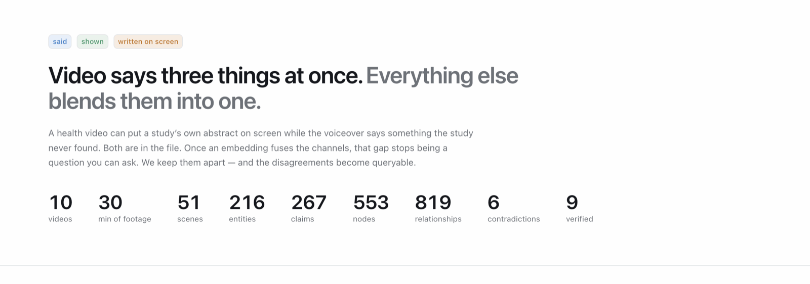
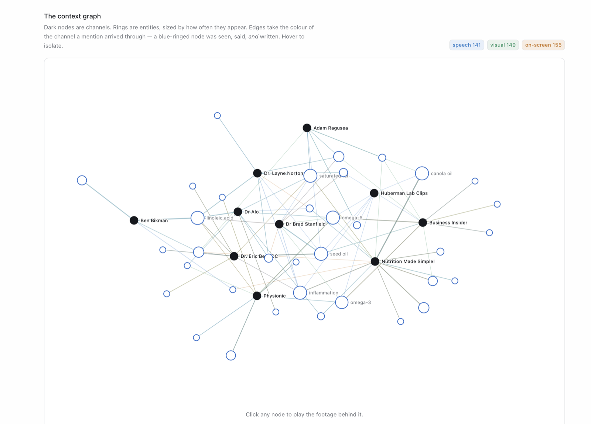
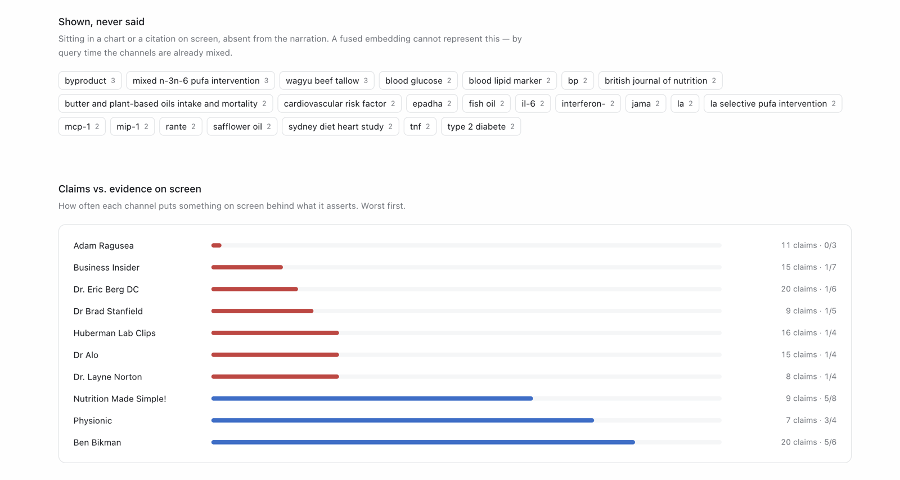
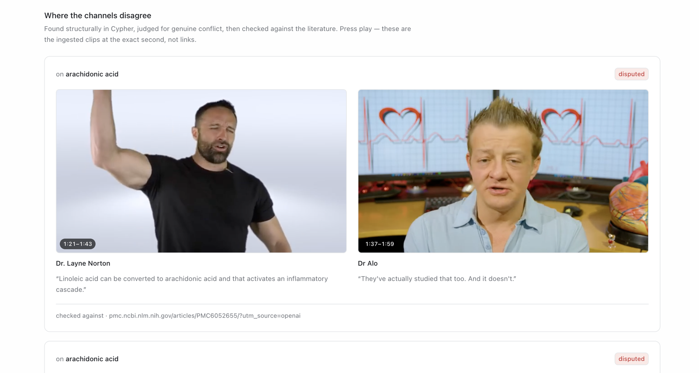
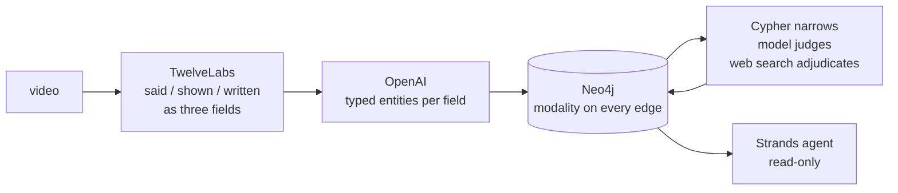

<h1 align="center">The Unreliable Narrator</h1>

<p align="center">
  Ten health channels. Everybody arguing. Nobody checking.<br/>
  <em>Ask a corpus of videos what nobody mentioned, and which two channels contradict each other.</em>
</p>

<p align="center">
  <a href="https://web-production-cde1b.up.railway.app"><strong>Live demo →</strong></a>
</p>

<p align="center">
  
</p>

<p align="center">
  <sub>Built at <b>Hack the Video Agent Context Graph</b> · AWS Builder Loft SF · 30 July 2026</sub>
</p>

---

## The problem

Every video says three things at once. What's **said** out loud. What's **shown**. And what's **written on screen** — the chart, the study title, the citation.

Every video AI system blends those three into one embedding before you can ask it anything. Once they're blended, you can't unblend them.

So here's a question nobody can currently ask: *where does the narrator disagree with the study he's showing you?*

---

## Three questions vector search cannot answer

### 1 · Count



Hover linoleic acid: **26 mentions, across 6 of 10 channels**, arriving through all three modalities at once — said, shown, *and* written.

Ask a vector store "how many" and it guesses. `count(DISTINCT v)` is a count.

### 2 · Negate



IL-6. TNF. The Sydney Diet Heart Study. Every one sitting in a chart or a citation on screen, and no narrator ever says it out loud.

There is no embedding for absence. This is a `NOT` in a `WHERE` clause, and that's the only reason it's answerable.

### 3 · Contradict



Two doctors. Same molecule. Opposite answer. Neither has ever seen the other video.

The graph put them next to each other — and then went and checked. The verdict is an edge pointing at a real paper. We never say true or false: **SUPPORTED**, **DISPUTED**, or **NO_SOURCE_FOUND**.

---

## How it works



One property carries the design — `(:Scene)-[:MENTIONS {modality}]->(:Entity)`. Keeping `speech`, `visual`, and `ocr` apart all the way into the graph is what turns "shown but never said" from impossible into a `WHERE` clause.

The agent reads the graph and only reads it. Every write goes through deterministic Python; the agent's Cypher tool refuses `CREATE`, `MERGE`, `DELETE`, `SET`, `DROP`.

| | |
|---|---|
| **TwelveLabs** | Returns spoken / on-screen / visible as three separate fields. Without this there is one transcript blob and no modality to query. |
| **OpenAI** | Types entities per field, judges which contradictions are real, adjudicates against the literature. |
| **Neo4j** | Holds the modality edges. A vector store cannot express `NOT`. |
| **Strands** (AWS) | The agent read path, behind a read-only Cypher guard. |

---

## Run it

```bash
git clone https://github.com/Princeu3/unreliable-narrator.git
cd unreliable-narrator

python3 -m venv .venv && .venv/bin/pip install -r requirements.txt
cp .env.example .env          # TwelveLabs + OpenAI keys, Neo4j Aura URI
cd ui && npm install && cd ..

.venv/bin/uvicorn server:app --port 8000   # API
cd ui && npm run dev                        # UI on :5173
```

Then ask it something:

```bash
python agent.py "what is shown on screen but never said?"
```

**→ [TECHNICAL.md](TECHNICAL.md)** — data model, contradiction pipeline, every Cypher query, setup detail, and the honest list of known limits.
