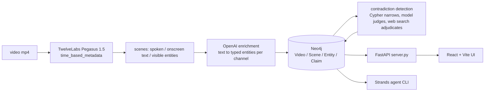

# Technical notes

Implementation detail for [The Unreliable Narrator](README.md). Everything here is in the four Python modules and `queries.cypher`.

## The data model

One property carries the whole design:

```cypher
(:Scene)-[:MENTIONS {modality}]->(:Entity)
```

`modality` is `speech`, `visual`, or `ocr`. TwelveLabs returns those as three separate fields per scene, and nothing downstream merges them. That is the reason "on screen but never spoken" is a `WHERE` clause here and is not representable in a fused embedding.

The rest of the graph:

| pattern | meaning |
|---|---|
| `(:Video)-[:HAS_SCENE]->(:Scene)` | a scene is a timestamped slice, `startSec` / `endSec` |
| `(:Scene)-[:ASSERTS]->(:Claim)` | a spoken claim, kept attached to the second it was said |
| `(:Claim)-[:CONTRADICTS]->(:Claim)` | found in Cypher, then judged |
| `(:Claim)-[:VERIFIED_AS {verdict}]->(:Evidence {url})` | `SUPPORTED`, `DISPUTED`, or `NO_SOURCE_FOUND` — never true or false |

Uniqueness constraints on `Video.id`, `Scene.id`, `Entity.name`, `Claim.id` make re-running ingest idempotent.

## Pipeline



## Contradiction detection

Three stages, cheapest first. This ordering is the point — a model comparing every claim pair is quadratic and unaffordable; Cypher does the narrowing for free.

1. **Cypher narrows.** Claim pairs from *different* channels about the *same* entity. No model involved.
2. **A model judges.** Candidates that are only a difference in emphasis get discarded. Survivors are genuine conflicts.
3. **Web search adjudicates.** Only survivors cost an API call. The verdict is written back as an edge pointing at a real URL.

Capped at 6 claims per run. The run prints what it left unchecked rather than truncating silently.

## The write path

The agent reads the graph and only reads it. Every write goes through deterministic Python in `ingest.py` and `verify.py`.

The agent's Cypher tool refuses `CREATE`, `MERGE`, `DELETE`, `SET`, `REMOVE`, `DROP`, `FOREACH`, `LOAD CSV`, and `CALL db.*` / `CALL apoc.*`. The guard matches on word boundaries, not substrings, and fails closed on anything it cannot parse.

## Sponsor tools

| tool | used for |
|---|---|
| **TwelveLabs** | `analyze_async` with `pegasus1.5` and a `segment_definitions` response format. One call per video returns timestamped scenes with `spoken_claims`, `onscreen_text`, `visible_entities`, and `evidence_shown` as separate fields (`ingest.py`). |
| **OpenAI** | Three passes. Entity extraction per channel with a structured `response_format` (`ingest.py`); contradiction judging over candidate claim pairs (`verify.py`); adjudication against the literature via the native `web_search` tool on `/v1/responses` (`verify.py`). |
| **Neo4j** | Aura instance holding the graph. Uniqueness constraints make re-running ingest idempotent (`ingest.py`, `queries.cypher`). |
| **Strands Agents** | Agent loop over three tools — `query_graph` (read-only Cypher), `find_contradictions`, `build_supercut` — on `OpenAIResponsesModel` (`agent.py`). |

Strands is an AWS project used as the agent framework. Nothing here runs on hosted AWS infrastructure.

`OpenAIResponsesModel` rather than the default Strands OpenAI model: the default does not expose the `/v1/responses` endpoint, and `gpt-5.6-terra` errors on function tools without it.

## Setup

Needs Python 3.12+, Node 20+, `ffmpeg`, and `yt-dlp` on PATH.

```bash
git clone https://github.com/Princeu3/unreliable-narrator.git
cd unreliable-narrator

python3 -m venv .venv
.venv/bin/pip install -r requirements.txt

cp .env.example .env      # TwelveLabs + OpenAI keys, Neo4j Aura URI + password
```

`NEO4J_URI` comes from the credentials file Aura hands you at instance creation (`neo4j+s://xxxxxxxx.databases.neo4j.io`). Everything reads plain environment variables:

```bash
set -a; source .env; set +a
```

Frontend deps, then the two processes:

```bash
cd ui && npm install && cd ..

.venv/bin/uvicorn server:app --reload --port 8000    # API on :8000
cd ui && npm run dev                                  # UI on :5173, proxies /api to :8000
```

## Getting videos in

Paste a YouTube URL into the UI, which downloads a 180s slice and runs the same pipeline, or use the terminal:

```bash
./fetch_corpus.sh                     # 8 seed-oil explainers, 180s each, 480p, into data/
python ingest.py                      # analyze every mp4 in data/ (cached) and write the graph
python ingest.py data/FDIgoBusMxY.mp4 # or one file
python verify.py                      # find conflicts, adjudicate, write verdict edges
python agent.py "what is shown on screen but never said?"
```

Flags: `ingest.py --from-cache` rebuilds the graph from `cache/` with no API calls, `--analyze-only` caches without writing, `--no-enrich` skips the OpenAI pass. `verify.py --report` prints candidate conflicts without writing. `--selftest` runs each module's logic offline. `node e2e.mjs` drives the live page with Playwright once both servers are up.

## Example queries

From `queries.cypher`.

Shown on screen, never spoken aloud:

```cypher
MATCH (e:Entity)<-[m:MENTIONS]-(:Scene)
WITH e, collect(DISTINCT m.modality) AS mods, count(m) AS hits
WHERE 'ocr' IN mods AND NOT 'speech' IN mods AND hits > 1
RETURN e.name AS shownButNeverSaid, e.type, mods, hits
ORDER BY hits DESC LIMIT 20;
```

Channels that discuss inflammation and never once mention linoleic acid:

```cypher
MATCH (v:Video)-[:HAS_SCENE]->(:Scene)-[:MENTIONS]->(:Entity {name:'inflammation'})
WITH DISTINCT v
WHERE NOT EXISTS {
  (v)-[:HAS_SCENE]->(:Scene)-[:MENTIONS]->(:Entity {name:'linoleic acid'})
}
RETURN v.channel, v.title, v.url;
```

Who disagrees with whom, with a timestamp link on both sides:

```cypher
MATCH (v1:Video)-[:HAS_SCENE]->(s1:Scene)-[:ASSERTS]->(a:Claim)-[x:CONTRADICTS]->(b:Claim)
MATCH (v2:Video)-[:HAS_SCENE]->(s2:Scene)-[:ASSERTS]->(b)
RETURN x.about AS about,
       v1.channel AS channelA, a.text AS claimA,
       v1.url + '&t=' + toString(toInteger(s1.startSec)) AS linkA,
       v2.channel AS channelB, b.text AS claimB,
       v2.url + '&t=' + toString(toInteger(s2.startSec)) AS linkB,
       x.rationale;
```

Any Cypher returning `videoId, startSec, endSec` is an edit decision list — `build_supercut` hands it to ffmpeg and returns a video.

## Known limits

- `verify.py` does not run as part of ingest. Contradiction and verdict edges only appear after you run it by hand, so a freshly ingested video shows up in the graph with no conflicts attached.
- The clip window is fixed. Both `fetch_corpus.sh` and the UI's ingest endpoint cut 180 seconds starting at a hardcoded offset — 60s in the UI path — rather than analyzing the whole video. That keeps the run inside the free analysis quota.
- Ingest reports failures as a truncated stderr tail on an SSE `error` step. Enough to know it broke, not enough to debug from; the real output is in the server log.
- YouTube downloads need browser cookies. `fetch_corpus.sh` and the UI ingest path both pass `--cookies-from-browser chrome`, so a machine without a logged-in Chrome profile gets a bot check instead of a video.
- Verification is capped at 6 claims per run.
- Entity keys are lowercase with naive singularization, so near-duplicate nodes are possible.
- Debunking channels state a position in order to rebut it. The judge is prompted to discard those, but extraction does not tag stance, so some quoted claims still read as assertions.
